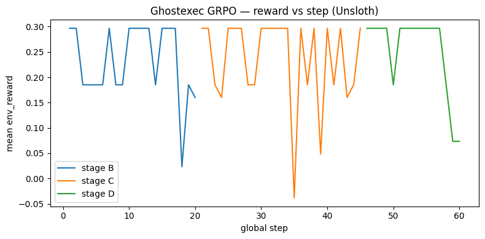
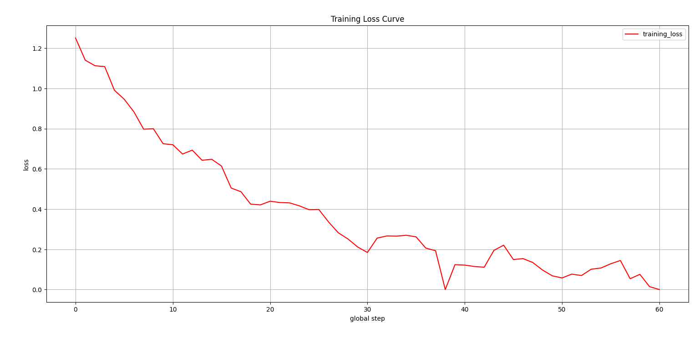
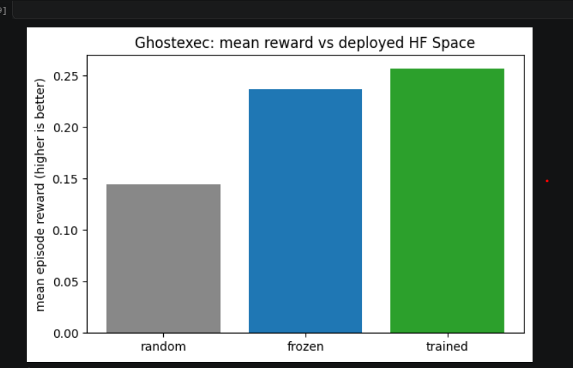

# Ghostexec: The AI Chief-of-Staff Environment

Ghostexec is an [OpenEnv](https://github.com/meta-pytorch/OpenEnv)-compliant environment where an LLM acts as an executive chief-of-staff under pressure: triaging inbox crises, resolving calendar conflicts, protecting stakeholder relationships, and finishing critical tasks.

The agent gets a dense plain-text briefing, takes one structured action, and is scored on three coupled dimensions: conflict reduction, relationship quality, and task progress.

## Submission Package

| Item | Link |
|------|------|
| Public HF Space (required) | [modelbuilderhq/ghostexec](https://huggingface.co/spaces/modelbuilderhq/ghostexec) |
| OpenEnv manifest | [`openenv.yaml`](openenv.yaml) |
| Training notebook (Colab-ready) | [`notebooks/ghostexec_unsloth_grpo_hf_api.ipynb`](notebooks/ghostexec_unsloth_grpo_hf_api.ipynb) |
| Minimal training script (Unsloth + TRL) | [`scripts/train_sft_then_grpo.py`](scripts/train_sft_then_grpo.py) |
| Mini-blog (required) | `ADD_HF_BLOG_URL_HERE` |
| Demo video <2 minutes (required) | `ADD_YOUTUBE_URL_HERE` |

## Why This Environment Is Competitive

- **Novel task composition**: combines language-heavy triage, social reasoning, scheduling constraints, and deadline management in a single trainable loop.
- **Non-trivial behavior**: valid JSON is necessary but not sufficient; the policy must choose useful actions on the right entity ids at the right time.
- **Dynamic world model**: mood shifts, conflict rebuilds, overdue penalties, and scenario drift events force adaptation over a trajectory.
- **Trainable reward signal**: dense step reward for learning plus bounded graders for evaluation.
- **Hackathon fit**: fully OpenEnv-packaged, hostable on HF Spaces, with reproducible training and visible before/after evidence.

## Judging-Criteria Mapping

### 1) Environment Innovation (40%)

- The observation is a realistic text briefing, not a toy tabular state dump.
- Actions are schema-bound (`GhostexecAction`) and validated against live world ids.
- The world evolves after each step (conflict graph, stress, mood, time shifts).
- Drift events in scenario data test robustness to changing conditions.

**Task ladder**

| Task ID | Difficulty | Scenario |
|---------|------------|----------|
| `phase2_core` | easy | `scenarios/phase2_core.json` |
| `monday_morning` | medium | `scenarios/monday_morning.json` |
| `dinner_disaster` | hard | `scenarios/dinner_disaster.json` |

### 2) Storytelling and Presentation (30%)

Ghostexec tells a familiar high-stakes story: too many urgent asks, not enough time, and every action has social + operational consequences.

The demo is easy to follow:
1. show the same briefing the model sees,
2. compare weak vs better action choice,
3. show reward movement and policy behavior improvements.

### 3) Showing Improvement in Rewards (20%)

The repo includes persisted training artifacts and plot outputs:

- `output/reward_curve.png`
- `output/loss_curve.png`
- `output/baseline_comparison.png`

**Training evidence plots**


*Reward trend across training progression.*


*SFT/GRPO training loss over optimization steps.*


*Random vs frozen vs trained policy mean episode reward.*

**Current before/after metrics (from saved artifacts)**

| Metric | Baseline | Trained |
|--------|----------|---------|
| Mean step reward | `0.145` | `0.257` |
| Invalid action rate | `Not logged in saved artifacts` | `Not logged in saved artifacts` |
| Grader score | `Not logged in saved artifacts` | `Not logged in saved artifacts` |

### 4) Reward and Training Pipeline (10%)

Ghostexec uses a coherent weighted reward core plus bounded shaping:

\[
\text{weighted\_base} = 0.35 \cdot \text{conflict} + 0.35 \cdot \text{relationship} + 0.30 \cdot \text{task}
\]

Then applies structured adjustments (invalid-action penalties, do-nothing pressure, completion/catastrophic terms) with transparent breakdown fields.

Training is end-to-end and environment-connected (not static-only): SFT warm start, then GRPO with environment reward plus local shaping functions.

## Quick Start

```bash
uv sync
uv run server --port 8000
```

Python client example:

```python
from ghostexec import GhostexecAction, GhostexecEnv

with GhostexecEnv(base_url="http://127.0.0.1:8000") as env:
    out = env.reset()
    print(out.observation.echoed_message[:400], "...")

    step = env.step(
        GhostexecAction(
            action_type="reply_email",
            email_id="e01",
            message_body="Acknowledged. Sending concise revised update before noon.",
        )
    )
    print("reward:", step.reward)
```

## Reproducible Training Commands

```bash
uv run python scripts/train_sft_then_grpo.py \
  --model-preset small_iter_fast \
  --training-preset hackathon_turbo \
  --env-url http://127.0.0.1:8000 \
  --generate-sft-from-env \
  --sft-samples 120 \
  --max-sft-steps 60 \
  --max-grpo-steps 120 \
  --env-reward-scale 1.0 \
  --local-reward-scale 0.35 \
  --complexity-curriculum easy_to_full \
  --curriculum-ramp-ratio 0.60
```

Generate post-train plots:

```bash
uv run python scripts/plot_training_report.py \
  --trainer-history outputs/trainer_state.json \
  --reward-csv outputs/reward_log.csv \
  --baselines-json outputs/compliance_manifest.json \
  --out-dir output
```

## OpenEnv and Space Deployment

```bash
openenv serve
openenv build
openenv validate --verbose
openenv push
```

If needed:

```bash
openenv push --repo-id your-username/ghostexec
```

## Environment API and Contract

- Core endpoints: `/reset`, `/step`, `/state`, `/schema`, `/health`, `/docs`, `/ws`
- Observation contains:
  - `echoed_message` (plain-text briefing),
  - optional metadata (step validity, reward breakdown, ids).
- Action schema: see `GhostexecAction` in [`models.py`](models.py).

Supported `action_type` values:

- `reply_email`
- `archive_email`
- `reschedule_meeting`
- `cancel_meeting`
- `complete_task`
- `delegate_task`
- `send_message`
- `do_nothing`

## Submission Readiness Checklist

- [x] OpenEnv latest-compatible environment with valid `openenv.yaml`
- [x] Public HF Space deployed and reachable
- [x] Minimal trainable script using Unsloth + TRL
- [x] Colab-ready notebook for reruns
- [x] Training evidence plots embedded in README
- [ ] Add HF blog link
- [ ] Add <2 minute YouTube demo link

## Repository Structure

```text
ghostexec/
├── openenv.yaml
├── pyproject.toml
├── models.py
├── client.py
├── graders.py
├── scenarios/
├── scripts/
├── notebooks/
├── tests/
├── output/
└── server/
    ├── app.py
    ├── ghostexec_environment.py
    └── reward.py
```

## Additional References

- [OpenEnv (Meta PyTorch)](https://github.com/meta-pytorch/OpenEnv)
- [OpenEnv Packaging and Deploying Docs](https://meta-pytorch.org/OpenEnv/auto_getting_started/environment-builder.html)
- [OpenEnv Hub](https://huggingface.co/openenv)
- [Environment Innovation Deep-Dive](environment-innovation/README.md)

## License

BSD-style license as included in this repository and upstream OpenEnv lineage notices.
